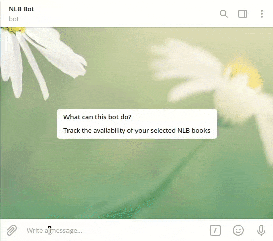

# nlb-telegram-bot

This Telegram bot tracks the availability of your selected NLB books.
You may add or delete books, refresh their availabilities, and check if they
are available at selected libraries.

Try it out at [\@sgnlbbot](https://telegram.me/sgnlbbot).



## Setting Up

### Environment file

Copy `.env.example` to a new file `.env` in the top-level project directory, with the
following configurations:

- `TOKEN`: Telegram API token from the BotFather
- `POSTGRES_USER`: Default `postgres`
- `POSTGRES_PASSWORD`: Default `postgres`
- `POSTGRES_DB`: Default `nlb`

### Docker

Both `docker` and `docker-compose` will need to be installed. Run
`docker-compose up` to serve the telegram bot and database:

``` sh
$ docker-compose up
```

### Telegram configurations (optional)

Set the following in Telegram with the BotFather:

- Set the bot icon with `assets/icon.png`.
- Set the command list using `/setcommands` with the following text:

```
start - Start the bot
help - Show help message
list - The main page. Add, delete, view, and refresh books here
howtoadd - Show instructions on how to add a book
source - Show further details about this project
```

## Deploying to Production

Create a file `production.ini`:

``` ini
[[nlb-servers]]
<your.ip.address.here> ansible_user=<user>
```

Copy `.env.example` to `.env.prod`, with the appropriate production credentials.

Make sure you have `python`, `pip`, `docker`, `docker-compose`, and `pipenv`
available on your production server, then deploy using this command:

``` sh
ansible-playbook playbook.yml -i production.ini
```

## Developer Notes

### Accessing the containers

Commands should typically be run from within the containers.

- To access the python bot container, run `docker exec -it <python-container> bash`.
- To access postgres, run `docker exec -it <postgres-container> psql -U <postgres-user> nlb`.

### Using Alembic

For more details, see the [Alembic tutorial](https://alembic.sqlalchemy.org/en/latest/tutorial.html).

#### Creating a migration

``` sh
$ pipenv run alembic revision -m "Create a new migration"
```

#### Upgrading/downgrading migrations

Remember to run these commands from *within* the python docker container:

``` sh
$ pipenv run alembic upgrade head  # Upgrade to latest version
$ pipenv run alembic upgrade +1    # Upgrade by 1 migration
$ pipenv run alembic downgrade -1  # Downgrade by 1 migration
```

### Using SQLAlchemy

For more details, see the [SQLAlchemy tutorial](https://docs.sqlalchemy.org/en/13/orm/tutorial.html).

Here's a sampling of what you can do with SQLAlchemy:

``` python
book = Book(bid=123, user_id=1337, title='TITLE', author='AUTHOR')
session.add(book)
session.commit()
session.delete(book)
session.rollback()

session.query(Book).all()
session.query(Book).first()

availability = Availability(
    book_id=book.id,
    branch_name='BRANCH',
    call_number='CALL',
    status_desc='STATUS',
    shelf_location='SHELF'
)
session.add(availability)
session.commit()

book.availabilities
# [<Availability(id=1, book_id=1, branch_name='BRANCH', status_desc='STATUS')]
availability.book
# <Book(id=1, bid=123, user_id=1337, title='TITLE', author='AUTHOR')
```

### Running the python console

Again, the console should be run from *within* the python docker container:

``` sh
$ pipenv run python -i models.py
```

This loads the session and models, allowing you to run the code as given in the SQLAlchemy section.

### Installing/uninstalling packages

To install or uninstall python packages, run these from *outside* the container:

``` sh
$ pipenv [un]install <package>
$ docker-compose build
```
